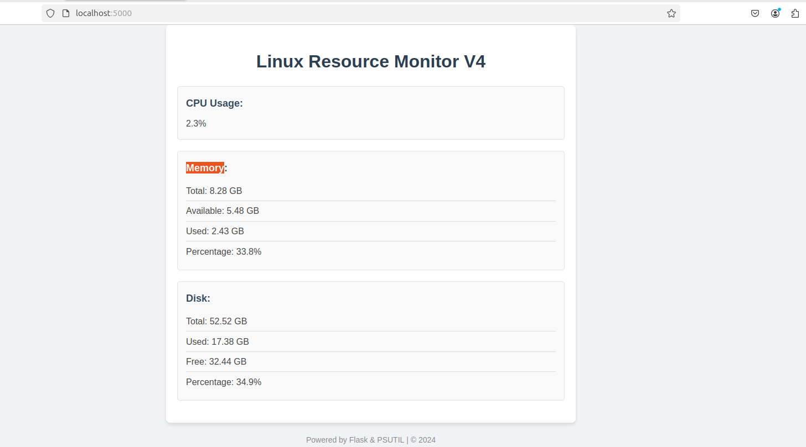

# Dockerized Linux Resource Monitoring Application

This project demonstrates the development of a Dockerized application that calculates and displays Linux resource data (e.g., CPU usage, memory usage, disk usage). The application is built using Flask and the `psutil` library for monitoring system resources. The project includes:

1. **Flask Application**: A Flask web server that collects and serves Linux resource data.
2. **Dockerfile**: A file used to containerize the Flask application and deploy it as a Docker image.
3. **Ansible Playbook**: Automates the deployment of the Dockerized application to a Linux server, including Docker Hub integration and rollback functionality.

## Main Project Structure

### 1. **App Folder**
This folder contains the Flask application that monitors Linux resources using the `psutil` library.

- **app.py**: The Flask application that runs the server and handles the `/resources` endpoint to fetch Linux resource data.
- **templates/index.html**: A simple HTML page that displays the Linux resource data (CPU, memory, and disk usage).
- **static/css/styles.css**: Styling for the index page to make the UI more user-friendly.

### 2. **Dockerfile**
- **Dockerfile**: The Dockerfile is used to containerize the Flask app. After building the Docker image, it is tagged as `hosny333/linux-resources-app:v*` and pushed to Docker Hub under the `ahosny333` account. The image is built, tested, and tagged with different versions (e.g., `v1`, `v2`, `v3`).

### 3. **Ansible Folder**
This folder contains the Ansible playbook responsible for deploying the Dockerized Flask application on a Linux server.

- **deploy_flask_app.yml**: The main playbook used to:
  - Log in to Docker Hub using `docker_username` and `docker_password`.
  - Pull the latest Docker image version.
  - Stop and remove any existing containers if running.
  - Deploy the Docker container and run the application.
  - Test the application by making a request to the `/resources` endpoint.
  - Rollback to the previous version in case of failure.

### 4. **Credentials File**
- **credentials.yml**: This file stores your Docker Hub credentials (`docker_username` and `docker_password`). It is encrypted using Ansible Vault for security. The encrypted file is used in the Ansible playbook to log in to Docker Hub.

---

## Prerequisites

Before you start, ensure the following:

- **Docker**: Make sure Docker is installed and configured on both your local machine and the target Linux server.
- **Ansible**: Install Ansible to run the playbook.
- **Ansible Vault**: Used to encrypt sensitive credentials like Docker Hub username and password.
- **Python 3**: The Flask application is built with Python 3 and the `psutil` library.

---

## Setup Instructions
## 1. Clone the Repository

Clone the project repository to your local machine:

```
git clone https://github.com/ahosny333/linux-resources-app.git
cd linux-resources-app
```
## 2. Build and Test the Docker Image
Navigate to the app folder and build the Docker image:


```
cd app
docker build -t linux-resources-app:v1 .
```
Tag the image with version numbers and push it to Docker Hub:

```

docker tag linux-resources-app:v1 your-dockerhub-username/linux-resources-app:v1
docker push your-dockerhub-username/linux-resources-app:v1
```
Repeat the above steps for additional versions (e.g., v2, v3).

## 3. Set Up Ansible
In the Ansible folder, you will find the playbook deploy_flask_app.yml. Before running it, create an encrypted credentials file to store your Docker Hub credentials:

```
ansible-vault encrypt credentials.yml
```
The credentials.yml should contain your Docker Hub credentials in the following format:

```
docker_username: your-dockerhub-username

docker_password: your-dockerhub-password
```

## 4. Run the Ansible Playbook
To deploy the Flask app using Ansible, run the following command. It will prompt you to enter the Vault password for decrypting the credentials:


```
ansible-playbook -i inventory deploy_flask_app.yml --ask-vault-pass -e "version=new_version previous_version=older_version"
```
This will pull the Docker image with *new_version*, deploy the Flask app to the localhost, and test the application. If the deployment fails, the playbook will roll back to the previous version *older_version*.

### Security
The Docker Hub credentials (docker_username and docker_password) are stored securely in the credentials.yml file and encrypted using Ansible Vault. The credentials file is only decrypted at runtime when the playbook is executed with the --ask-vault-pass option.

### Rollback Strategy
If the application deployment fails (e.g., the container is not running or the application is not accessible), the playbook will automatically rollback to the previous version of the Docker image, ensuring minimal downtime.

### Troubleshooting
* Docker Image Pull Fails: Ensure the image name and tag are correct and available on Docker Hub.
* Application Not Accessible: Verify that the Docker container is running and the correct ports are exposed.
* Ansible Vault Issues: Ensure that the correct Vault password is provided when running the playbook.


